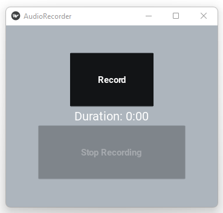

# Audio Recorder App

## Overview

The Audio Recorder App is a simple application built using Python and KivyMD that allows users to record audio and save it as a .wav file. The app provides a user-friendly interface with buttons to start and stop recording, and displays the duration of the recording in real-time.

## Features

- Record audio in .wav format
- Display real-time duration of recording
- Simple and intuitive user interface
- Save recorded audio to a specified directory

## Requirements

- Python 3.6+
- KivyMD
- PyAudio
- Kivy

## Installation

1. Clone the repository
2. Install the required dependencies using pip:
   ```
   pip install kivy kivymd pyaudio
   ```
3. Run the main.py file to start the application
4. Click the 'Start Recording' button to begin recording audio
5. Click the 'Stop Recording' button to stop recording and save the audio file

## Screenshots



## File Structure

- `main.py`: Main application file
- `assets/audio`: Directory to store recorded audio files

## License

This project is licensed under the MIT License - see the [LICENSE](LICENSE) file for details.